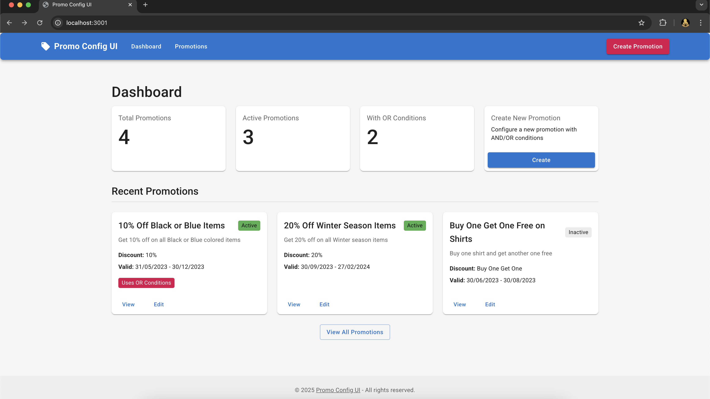
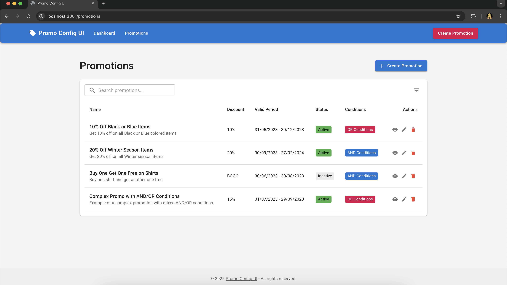
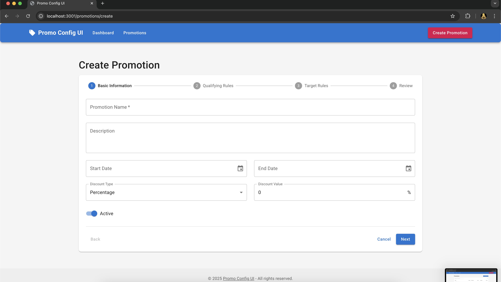
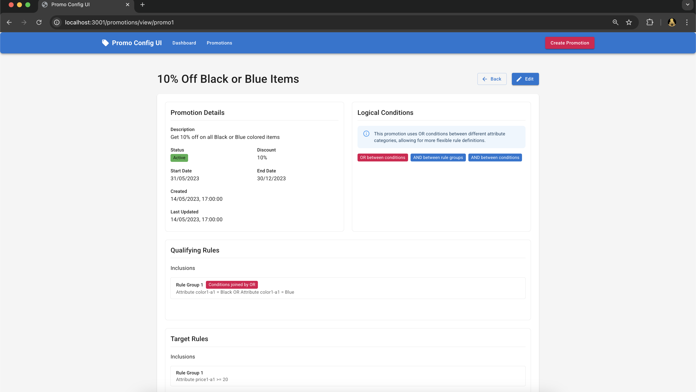
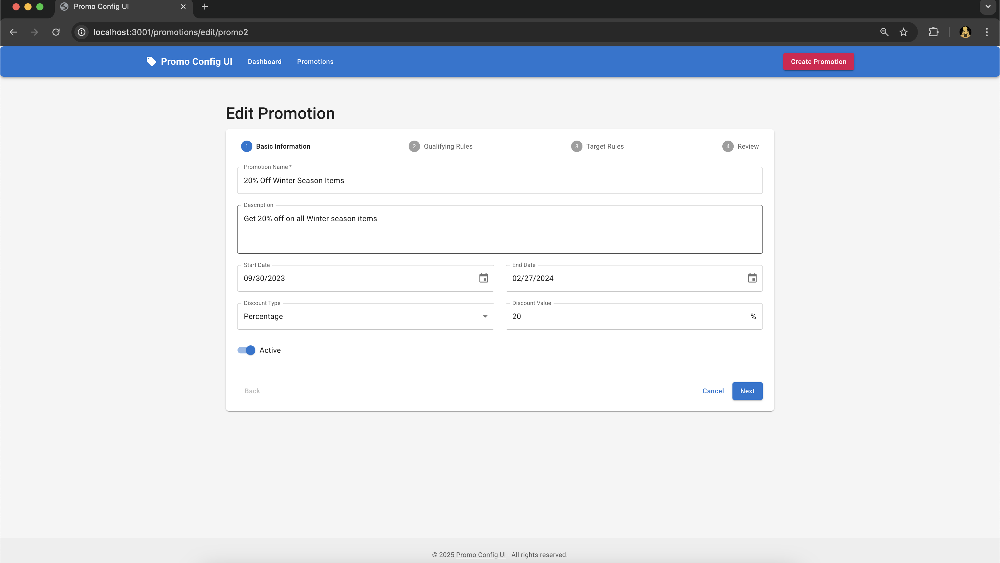
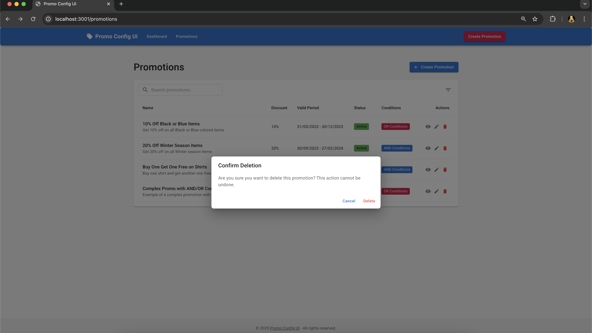

# Promo Config UI

A modern React application for configuring promotional rules with support for complex AND/OR conditions between different attribute categories.

## Features

- Create and edit promotions with AND/OR conditions
- Support for OR conditions between different attribute categories (Product, Customer, Order, etc.)
- Intuitive UI for configuring complex logical conditions
- List view showing AND/OR relationships between attributes
- Confirmation screen displaying complete promotion logic
- Default AND behavior with option to select OR

## UI Screenshots

### Dashboard

*Dashboard view showing promotion statistics and recent promotions*

### Promotions List

*List of all promotions with details including name, discount, validity period, status, and conditions*

### Create Promotion

*Form to create a new promotion with basic information*

### Edit Promotion

*Interface for editing an existing promotion's details*

### View Promotion

*Detailed view of a promotion showing all information and logical conditions*

### Confirm Deletion

*Confirmation dialog when deleting a promotion*

## Getting Started

### Prerequisites

- Node.js (v14 or higher)
- npm or yarn

### Installation

1. Clone the repository
2. Install dependencies:
   ```
   npm install
   ```
   or
   ```
   yarn install
   ```

3. Start the development server:
   ```
   npm start
   ```
   or
   ```
   yarn start
   ```

4. Open [http://localhost:3000](http://localhost:3000) to view the application in your browser.

## How to Run the Project

1. Make sure you have Node.js installed on your system
2. Navigate to the project directory in your terminal
3. Install the required dependencies:
   ```
   npm install
   ```
4. Start the development server:
   ```
   npm start
   ```
5. The application will open in your default browser at http://localhost:3000

## How to Use the Application

1. **Dashboard**: The home page shows an overview of all promotions and key metrics
2. **Promotions List**: View all promotions with their details and status
3. **Create Promotion**: Create a new promotion with the following steps:
   - Enter basic information (name, description, dates, discount)
   - Configure qualifying rules with AND/OR conditions
   - Configure target rules with AND/OR conditions
   - Review and save the promotion
4. **Edit Promotion**: Modify existing promotions with the same interface as creation
5. **View Promotion**: See detailed information about a specific promotion

## Project Structure

- `src/components`: Reusable UI components
- `src/pages`: Page components for different views
- `src/services`: API and data services
- `src/utils`: Utility functions
- `src/context`: React context providers
- `src/hooks`: Custom React hooks
- `src/types`: TypeScript type definitions
- `src/store`: State management

